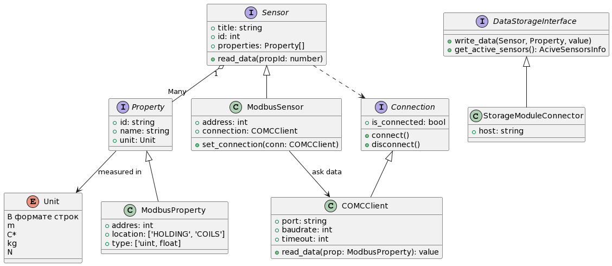

# Модуль считывания информации с датчиков

Используется Python версии 1.12.4

# Использование модуля
_Предварительно должен быть запущен модуль хранения данных_

## Запуск

Запуск примера UI версии модуля, которая в будущем будет переработана в консольное приложение, так как для отображения работы используется веб интерфейс.

```bash
uvicorn use_sensor_module:app --reload --port 3005
```

# Документация

## Диаграмма UML
Для ознакомления с архитектурой модуля смотрите диаграмму UML:


## Добавление новых датчиков
Чтобы добавить поддержку новых датчиков в систему, необходимо выполнить следующие шаги:
1. Определите интерфейс нового датчика в соответствии с уже существующей архитектурой.
2. Реализуйте класс датчика, наследуя базовый класс и реализуя необходимые методы, делать это
лучше в отдельном пакете. Примерами служат random_sensor и modbus_sensor.
3. Добавьте новый класс датчика в систему инициализации модуля, то есть в файл [sensors_module.py](sensors_module.py) функция `create_sensors_from_response`
