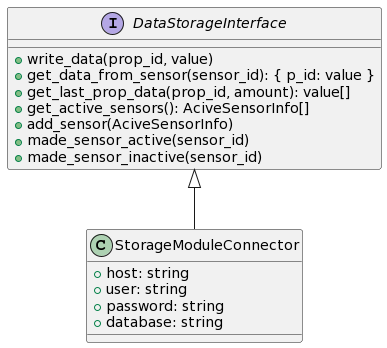
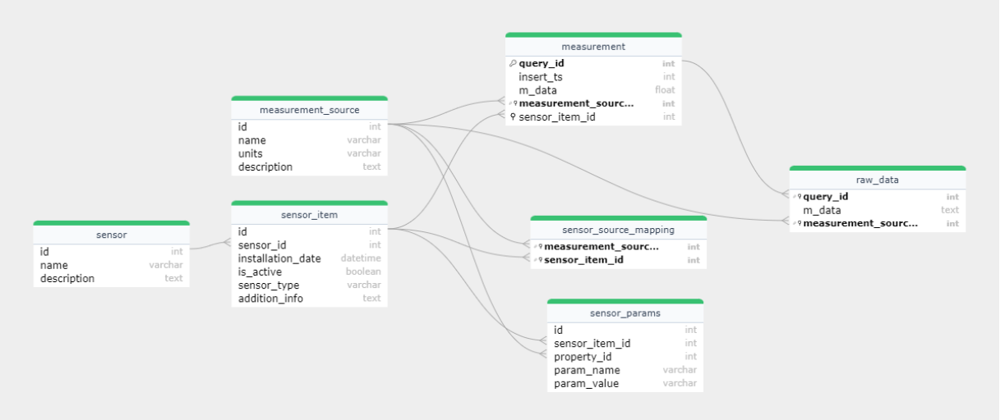

# Модуль хранения данных

Используется Python версии 3.12.4

## Установка

1. `python -m venv venv`
2. `.\venv\Scripts\activate` (Windows)
3. `pip install -r requirements.txt`

НЕТ БИБЛИОТЕК ДЛЯ ТЕСТРОВАНИЯ!!! TODO

- Необходимо внести данные БД для подключения к MySQL в конфиге

## Установка докер контейнера

...

## Запуск модуля
Для запуска модуля, который использует FastAPI для обработки запросов, выполните следующую команду:

```bash
uvicorn data_storage_module:app --reload --port 3000
```

Это запустит сервер на `localhost` с портом `3000`. Параметр `--reload` позволяет автоматически перезагружать сервер при изменениях в коде. Дополнительно можно указать параметр `--host`, который позволит названить IP адрес сервера.

## Диаграмма UML
Ознакомьтесь с архитектурой модуля, просмотрев диаграмму UML:



## ER-диаграмма
Для понимания структуры базы данных модуля смотрите ER-диаграмму:

