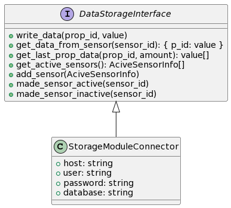

# Модуль хранения данных

## Запуск модуля
Для запуска модуля, который использует FastAPI для обработки запросов, выполните следующую команду:

```bash
uvicorn data_storage_module:app --reload --port 3000
```

Это запустит сервер на `localhost` с портом `3000`. Параметр `--reload` позволяет автоматически перезагружать сервер при изменениях в коде.

## Диаграмма UML
Ознакомьтесь с архитектурой модуля, просмотрев диаграмму UML:



## ER-диаграмма
Для понимания структуры базы данных модуля смотрите ER-диаграмму:


# Загрузка файлов
Для примера был создан эндпоинт uploadfile и таблица с файлами в бд, а также [пример их использования](examples/file_upload.py)